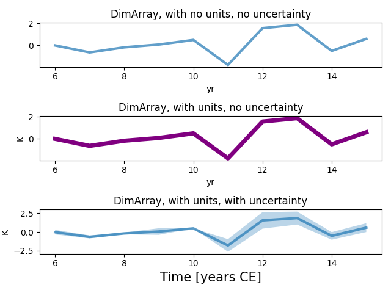

# PyPlotExt

Extension of PyPlot that allows for easy plotting with common Julia packages (Unitful.jl, Measurements.jl)
=======
This package extends common `PyPlot.jl` functions for common Julia packages with specialized data types. For instance, this allows for simple shortcuts to plot `DimArray`s (`from DimensionalData.jl`). It also allows for plotting of `Measurements` (data types with values and uncertainties from `Measurements.jl`) and `Quantities` (values with units from `Unitful.jl`). I attempt to follow typical `matplotlib` formatting conventions, but for some edge cases (e.g., a ribbon plot with a central estimate and uncertainty), new syntax must be used to distinguish between the different `matplotlib` elements being used (e.g, a `plot` and a `fill_between`). 

Here, we show an example of three different extensions of `PyPlot` that allow for easy plotting of `DimArrays`, as plain values, with units, and with uncertainties.
~~~
data = randn(3, 10)K
dataunc = abs.(randn(3,10))K
ax1 = Symbol.(["A", "B", "C"])
ax2 = 6yr:1yr:15yr
da = DimArray(data .± dataunc, (X(ax1), Ti(ax2)))
figure()
N = 3 
subplot(N, 1, 1)
plot(ustrip.(value.(da[At(:A), :])))
title("DimArray, with no units, no uncertainty")

subplot(N,1,2)
plot(value.(da[At(:A), :]), lwcentral = 5, alpha = 1, color = "purple")
title("DimArray, with units, no uncertainty")

subplot(N, 1, 3)
plot(da[At(:A), :])
title("DimArray, with units, with uncertainty")
xlabel("Time [years CE]", fontsize = 15) 
tight_layout()
savefig("../plots/dimarray.png")
~~~

Other functionality includes ignoring `Missing` values while plotting. This package is not exhaustive for every possible combination of parameters. Future functionality could include extending other common plotting recipes, like `contourf`, `contour`, etc...
